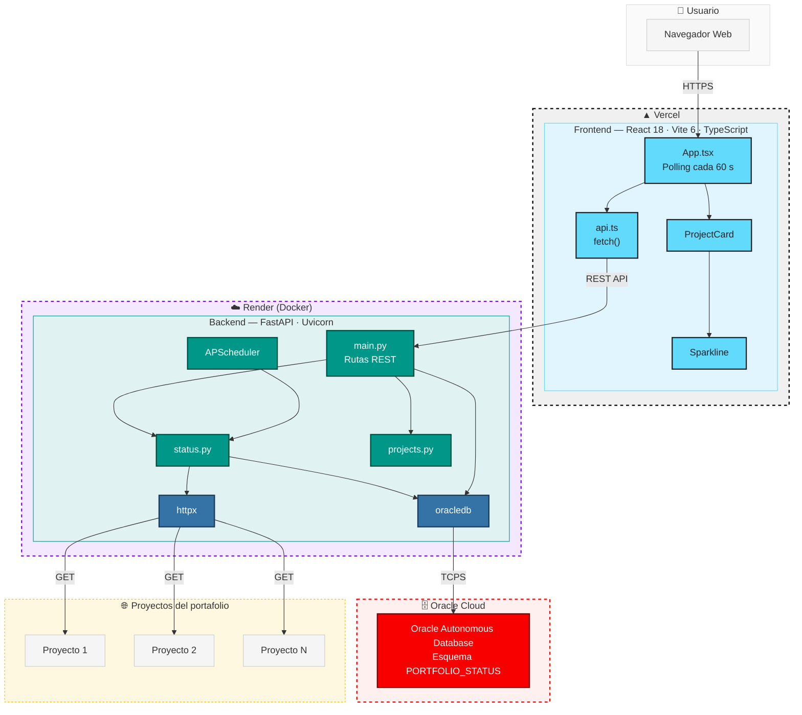

# ColombiaTech2


Plataforma de alquiler de vivienda con chat en tiempo real entre interesado y
arrendador. Backend unificado en NestJS que expone REST, GraphQL y WebSockets
sobre la misma base de código, con frontend en React.

## Demo en vivo

- **Aplicación:** [colombia-tech2.vercel.app](https://colombia-tech2.vercel.app)
- **API REST:** `https://colombiatech2.onrender.com/api`
- **GraphQL Playground:** `https://colombiatech2.onrender.com/graphql`

> El backend corre en el plan gratuito de Render, que suspende el servicio tras
> un período de inactividad. La primera petición tras la suspensión puede
> tardar entre 30 y 50 segundos en responder mientras el servicio despierta.

## Arquitectura



## Funcionalidades

- Registro e inicio de sesión con JSON Web Tokens
- Publicación y consulta de inmuebles
- Carga de imágenes (avatares y fotos de inmuebles) con almacenamiento
  persistente en la nube
- Acceso restringido: cada usuario solo alcanza su propia información
- Chat en tiempo real mediante WebSockets
- Misma información disponible por REST y por GraphQL

## Arquitectura

```
Cliente (React) ──HTTP/REST──▶ NestJS ──▶ MongoDB
       │         ──GraphQL──▶  (Apollo, code-first)
       └─────────WebSocket───▶  Socket.IO Gateway
```

Un único backend NestJS sirve las tres interfaces (REST, GraphQL y
WebSockets) sobre los mismos módulos de dominio, evitando duplicar lógica de
negocio entre capas.

## Estructura

```
ColombiaTech2/
├── backend/          NestJS — REST, GraphQL y WebSockets
│   └── src/
│       ├── auth/     Autenticación JWT y guards
│       ├── users/
│       ├── houses/
│       ├── upload/   Carga de imágenes a Cloudinary
│       └── messages/ Gateway del chat
└── frontend/         React + Vite + Redux Toolkit + Tailwind
    └── src/
        ├── components/
        ├── pages/
        └── store/    Estado global con Redux Toolkit
```

## Stack

**Backend:** NestJS, MongoDB con Mongoose, GraphQL (Apollo, enfoque code-first),
Passport con JWT, Socket.IO

**Frontend:** React 18, Vite, Redux Toolkit, React Router, Tailwind CSS,
Socket.IO client

## Conexiones externas

| Servicio | Uso |
|---|---|
| MongoDB Atlas | Persistencia de datos (usuarios, casas, mensajes) |
| Cloudinary | Almacenamiento de imágenes (avatares de usuario y fotos de inmuebles) |

## Requisitos

- Node.js 18 o superior
- npm
- Una instancia de MongoDB accesible
- Una cuenta de Cloudinary (plan gratuito) para la carga de imágenes

## Ejecución

Backend y frontend se levantan por separado, en dos terminales.

### Backend

```bash
cd backend
npm install
cp .env-ejemplo .env
npm run start:dev
```

El `.env` requiere la cadena de conexión a MongoDB, un secreto para firmar los
tokens y las credenciales de Cloudinary. La plantilla indica el nombre de cada
variable.

Queda escuchando en `http://localhost:3000`.

- API REST bajo `/api`
- Consola de GraphQL en `/graphql`
- WebSocket del chat en la misma raíz

### Frontend

```bash
cd frontend
npm install
cp .env.example .env
npm run dev
```

El `.env` necesita la URL del backend. Queda en `http://localhost:5173`.

## Despliegue

El backend está preparado para Render, que en su plan gratuito admite conexiones
WebSocket persistentes. El frontend, para Vercel.

Ambos requieren definir las mismas variables de entorno del `.env` en el panel
del proveedor.

## Autor

**Luis Felipe Arias Carriazo**
[GitHub](https://github.com/lariasca1994) · [LinkedIn](https://linkedin.com/in/lfac1)